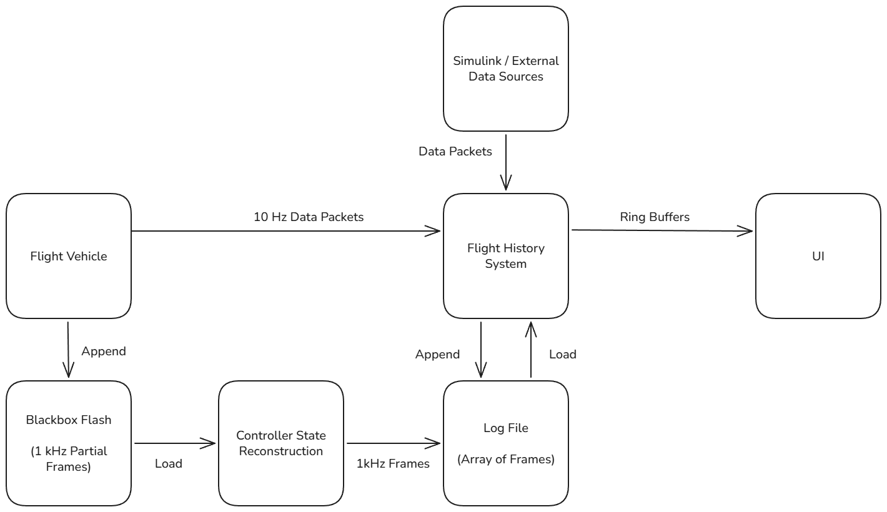

# Flight History System

The flight history system takes a data stream and converts it into a structured representation of a flight that can be used in data view panels. The data stream can be from the flight vehicle / groundstation, from a log file, or from a simulation.



Data Formats:
 - Packet - a struct containing some vehicle data from a single point in time
 - Frame - a special packet containing all vehicle data from a single point in time
 - Log File - an array of frames for a specific flight
 - Flight History Ring Buffer - contains data from a subset of frames saved as a per-property ring buffer (see below)

## Flight History Ring Buffers

Telemetry from the vehicle is transmitted as a (nested) struct of various flight properties:

See: [toad_telemetry.h](/firmware/lib/can_bus/toad_telemetry.h)

```cpp
struct gnc_telemetry_t {
  float accel_x;
  float accel_y;
  float accel_z;
  ...
}
```

These could be naturally stored in an array:

```cpp
gnc_telemetry_t packets[LEN];
```

However, many panels use the history of a single field, so storing each field as its own array is better for performance. See: https://en.wikipedia.org/wiki/AoS_and_SoA

Therefore, the actual layout looks like:

See: [flight_history.h](/UI/gen/flight_history.h)

```cpp
struct flight_history_t {
  float accel_x[LEN];
  float accel_y[LEN];
  float accel_z[LEN];
  ...
}
```

These are read as a ring buffer where the oldest data point is replaced when a new packet is arrived.
However, to allow for contiguous reads the data is actually stored twice and read/written with the scheme shown below.

```cpp
struct flight_history_t {
  float accel_x[LEN * 2];
  float accel_y[LEN * 2];
  float accel_z[LEN * 2];
  ...
}
```

| State | 0   | 1   | 2   | 3   | 4   | 5   | 6   | 7   | Write | Read         |
| ----- | --- | --- | --- | --- | --- | --- | --- | --- | ----- | ------------ |
| Start | -   | -   | -   | -   | -   | -   | -   | -   | 0 & 4 | 0 - 3 "____" |
| Rcv A | A   | -   | -   | -   | A   | -   | -   | -   | 1 & 5 | 1 - 4 "___A" |
| Rcv B | A   | B   | -   | -   | A   | B   | -   | -   | 2 & 6 | 2 - 5 "__AB" |
| Rcv C | A   | B   | C   | -   | A   | B   | C   | -   | 3 & 7 | 3 - 6 "_ABC" |
| Rcv D | A   | B   | C   | D   | A   | B   | C   | D   | 0 & 4 | 0 - 3 "ABCD" |
| Rcv E | E   | B   | C   | D   | E   | B   | C   | D   | 1 & 5 | 1 - 4 "BCDE" |

For ease of access, the following macros are provided.
`fh_now` give the last written value for a flight history property.
`fh_all` gives an array of the last LEN items for a flight history property.

```cpp
#define fh_now(x) ((x)[read_end_pos])
#define fh_all(x) (&((x)[read_start_pos]))

// use fh_now
float fill_level = fh_now(FlightHistory.ox_fill_level);

// use fh_all
float *fill_level_arr = fh_all(FlightHistory.ox_fill_level);
```

## Flight History Files

For flight replays, saving an array of all vehicle states to a file is useful. Because the flight could be arbitrarily long, this is saved as an array of `flight_frame_t`, where `flight_frame_t` is equivalent to `flight_history_t` except without arrays. These files can then be read back in by committing the flight frames in the same manner as how vehicle packets are committed.

## Controller State Reconstruction

During flight, flight frames are logged to the blackbox flash on the FC and EC.
These frames store sufficient data to reconstruct the internal state of the controllers
on each board.
(Controller state is based on previous state and inputs, so logging all inputs and knowing the starting state is sufficient. This saves memory and logging bandwidth, and allows arbitrary internal variables to be examined later.)

Controller state reconstruction outputs the same file format as the flight history file described above, but at a higher frequency and with additional state data.

## Build System

[flight_history.cpp](/UI/gen/flight_history.cpp) and [flight_history.h](/UI/gen/flight_history.h) are generated automatically from the telemetry structs in the firmware by a Makefile rule in [UI.mk](/UI.mk). The rule will automatically be run when any dependency or the generator script is changed.
